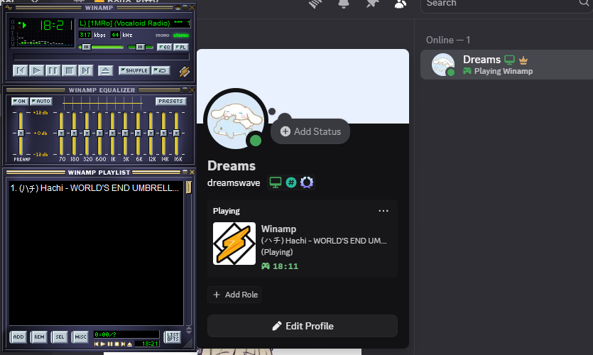
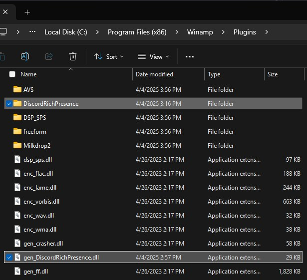

# Winamp Discord Rich Presence

A lightweight plugin that integrates Discord Rich Presence into Winamp, showcasing your current track and playback status on Discord in real-time.

This plugin brings your Winamp listening experience to Discord, displaying track details, playback status, and more. See it in action:



## Features

- Displays current track title and artist on Discord
- Shows playback status: Playing, Paused, or Idle
- Includes elapsed time for the current track
- Supports radio streams
- Customizable Discord Application ID
- Full Unicode support (e.g., Japanese, Korean, Chinese characters)

## Requirements

- **Winamp**: Version 5.8 or newer
- **Discord**: Desktop application (web version not supported)
- **Operating System**: Windows 10 or 11
- **Discord Application ID**: Required for setup (see [Installation](#installation))

### Tested On

- Windows 11
- Winamp 5.9.2 (x86)

## Installation

Get started with these steps:

1. **Download**: Grab the latest release from the [Releases](https://github.com/DreamsWave/wdrp/releases) page.
2. **Extract**: Unzip and copy `gen_DiscordRichPresence.dll` and the `DiscordRichPresence` folder to your Winamp plugins directory (typically `C:\Program Files (x86)\Winamp\Plugins`).
3. **Restart**: Close and reopen Winamp if it’s running.
4. **Configure**:

   - Open Winamp Preferences (`Ctrl+P`), go to **Plug-ins > General Purpose**, find "Discord Rich Presence," and double-click to open settings.
   - Visit the [Discord Developer Portal](https://discord.com/developers/applications).
   - Create a new application (e.g., "Winamp"), optionally set an icon ([classic logo](https://commons.wikimedia.org/wiki/File:Winamp-logo.png)), and copy the **Application ID**.
   - Paste the **Application ID** in the plugin settings and click **OK**, or edit `C:\Program Files (x86)\Winamp\Plugins\DiscordRichPresence\settings.ini` manually with:

     ```
     ApplicationID=your_application_id_here
     ```

## Troubleshooting

- **Plugin not listed in Winamp?**
  - Verify `gen_DiscordRichPresence.dll` and the `DiscordRichPresence` folder are in `C:\Program Files (x86)\Winamp\Plugins`.
  - See: 
- **No Discord status?**
  - Ensure Discord is running and "Game Activity" is enabled (**Settings > Activity Settings**).
  - Check `settings.ini` contains `ApplicationID=your_application_id_here` (not all zeros).
- **Still stuck?** Check the [Discord Developer Docs](https://discord.com/developers/docs/rich-presence/overview).

## Building from Source

For developers looking to compile the plugin:

### Prerequisites

- **Visual Studio**: 2019 or 2022 with C++ development workload
- **Git**: Git for Windows
- **Privileges**: Administrator access for deployment

### Steps

1. Clone the repo:

   ```sh
   git clone https://github.com/DreamsWave/wdrp.git
   cd wdrp
   ```

2. Open `DiscordRichPresence.sln` in Visual Studio.
3. Set configuration to Release and platform to x86 or Win32.
4. Build the solution (F7 or Build > Build Solution).
   - Deploy (requires admin rights):
   - Open Command Prompt as Administrator.
5. Navigate to the project folder:

   ```sh
   cd path\to\wdrp
   ```

6. Run:

   ```sh
   .\CopyToInstall.cmd
   ```

7. Restart Winamp.

## FAQ

_Note: Some answers may reflect older versions._

- **Do I need to build from source?**
  No, download pre-built binaries from [Releases](https://github.com/dreamswave/wdrp/releases).

- **Does it need Discord credentials?**
  No, only an Application ID is required.

- **Why "Playing a game" instead of "Listening to"?**
  Discord’s RPC doesn’t allow custom labels for third-party plugins yet—Spotify gets special treatment.

- **Why a delay in status updates?**
  Discord limits updates to every 15 seconds (details).

- **Can it show album art?**
  Not yet—Discord requires manual image uploads via the Developer Portal.

- **Can others hear my music?**
  No, Rich Presence shares metadata only. Use Discord’s Go Live for audio streaming.
